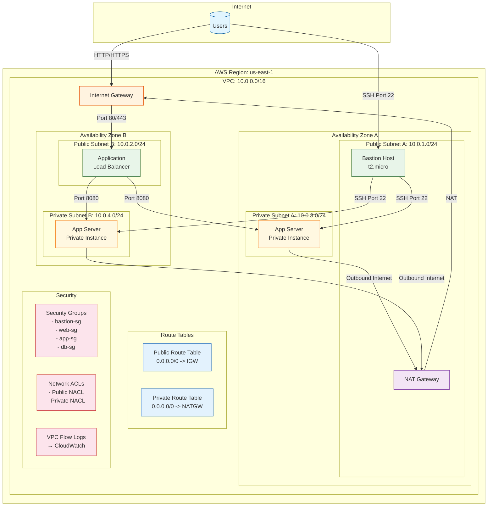
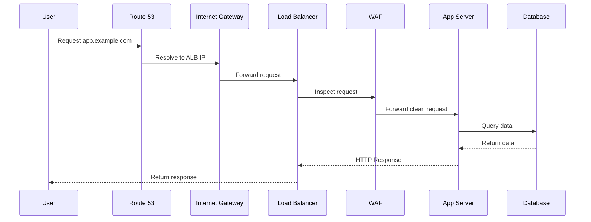
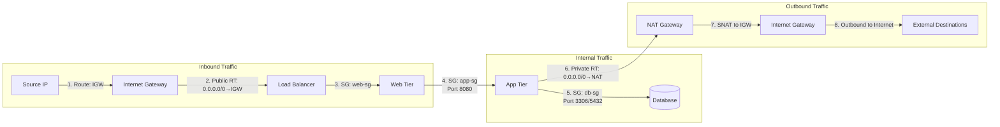

# VPC Architecture Diagram

## Deployment Architecture Flow

## Network Traffic Flow Diagram

## Tagging Strategy

| Key | Value | Purpose |
|-----|-------|---------|
| `Project` | VPC-Network | Project identification |
| `Environment` | Development | Environment classification |
| `ManagedBy` | Manual (Week2-3) | Management method |
| `CostCenter` | Internship | Cost allocation |
| `Owner` | Lawrence | Resource ownership |

