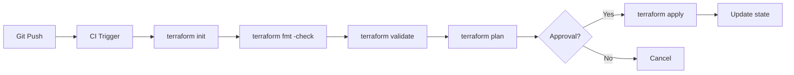

# Terraform Infrastructure as Code - Architecture Design

## Overview
Design document for the Terraform-based Infrastructure as Code project. This implements the same VPC architecture from Project 1, but managed entirely through code.

---

## Architecture Goals
1. **Repeatability:** Deploy identical infrastructure across environments
2. **Modularity:** Reusable components for different projects
3. **Version Control:** All infrastructure changes tracked in Git
4. **Collaboration:** Remote state for team workflows
5. **Automation:** CI/CD pipeline ready

---

## Terraform Configuration Design

### File Structure
```
terraform/
├── main.tf                 # Root module - resource orchestration
├── variables.tf            # Input variables with validation
├── outputs.tf              # Output values for reference
├── terraform.tfvars        # Variable values (gitignored)
├── terraform.tfvars.example # Example variable values (committed)
├── backend.tf              # S3 + DynamoDB backend config
├── providers.tf            # AWS provider configuration
├── modules/
│   ├── vpc/
│   │   ├── main.tf
│   │   ├── variables.tf
│   │   ├── outputs.tf
│   │   └── README.md
│   ├── ec2/
│   │   ├── main.tf
│   │   ├── variables.tf
│   │   ├── outputs.tf
│   │   └── README.md
│   └── security-groups/
│       ├── main.tf
│       ├── variables.tf
│       ├── outputs.tf
│       └── README.md
```

---

## Module Design

### 1. VPC Module
**Purpose:** Create VPC, subnets, IGW, NAT Gateway, and route tables

**Inputs:**
| Variable | Type | Default | Description |
|----------|------|---------|-------------|
| `vpc_cidr` | string | `10.0.0.0/16` | VPC CIDR block |
| `public_subnet_cidrs` | list(string) | `["10.0.1.0/24", "10.0.2.0/24"]` | Public subnet CIDRs |
| `private_subnet_cidrs` | list(string) | `["10.0.3.0/24", "10.0.4.0/24"]` | Private subnet CIDRs |
| `availability_zones` | list(string) | `["us-east-1a", "us-east-1b"]` | AZs for subnets |
| `enable_nat_gateway` | bool | `true` | Deploy NAT Gateway |
| `tags` | map(string) | `{}` | Common resource tags |

**Outputs:**
| Output | Description |
|--------|-------------|
| `vpc_id` | VPC ID |
| `public_subnet_ids` | List of public subnet IDs |
| `private_subnet_ids` | List of private subnet IDs |
| `nat_gateway_id` | NAT Gateway ID (if created) |
| `internet_gateway_id` | IGW ID |

### 2. EC2 Module
**Purpose:** Deploy EC2 instances with security and configuration

**Inputs:**
| Variable | Type | Default | Description |
|----------|------|---------|-------------|
| `subnet_id` | string | - | Subnet to launch instance in |
| `security_group_ids` | list(string) | `[]` | SGs to attach |
| `instance_type` | string | `t2.micro` | EC2 instance type |
| `ami_id` | string | latest Amazon Linux 2 | AMI to use |
| `key_name` | string | - | SSH key pair name |
| `user_data` | string | `""` | Bootstrap script |

**Outputs:**
| Output | Description |
|--------|-------------|
| `instance_id` | EC2 Instance ID |
| `public_ip` | Public IP (if assigned) |
| `private_ip` | Private IP |

### 3. Security Groups Module
**Purpose:** Create reusable security group rules

**Inputs:**
| Variable | Type | Default | Description |
|----------|------|---------|-------------|
| `vpc_id` | string | - | VPC to create SGs in |
| `allowed_ssh_cidrs` | list(string) | `[]` | CIDRs allowed SSH access |
| `allowed_web_cidrs` | list(string) | `["0.0.0.0/0"]` | CIDRs allowed HTTP/HTTPS |
| `environment` | string | `"dev"` | Environment name |

**Outputs:**
| Output | Description |
|--------|-------------|
| `bastion_sg_id` | Bastion host SG ID |
| `web_sg_id` | Web tier SG ID |
| `app_sg_id` | App tier SG ID |

---

## State Management Design

### Remote Backend (S3 + DynamoDB)
```
┌──────────────────┐     ┌──────────────────────┐
│   Terraform      │     │    AWS S3 Bucket      │
│   State File     │────▶│   terraform-state     │
│                  │     │   key: env/dev/       │
│                  │     │   terraform.tfstate   │
└──────────────────┘     └──────────────────────┘
        │
        │ State Locking
        ▼
┌──────────────────┐
│ DynamoDB Table   │
│ terraform-locks  │
│ LockID (primary) │
└──────────────────┘
```

---

## CI/CD Pipeline Integration



---

## Security Considerations
| Concern | Solution |
|---------|----------|
| State file secrets | S3 SSE + DynamoDB encryption |
| Access control | IAM roles for Terraform |
| Variable sensitivity | `sensitive = true` for secrets |
| Drift detection | `terraform plan` in CI/CD |
| Version pinning | Provider version constraints |

---

## References
- [Terraform Best Practices](https://developer.hashicorp.com/terraform/cloud-docs/recommended-practices)
- [Terraform AWS Provider](https://registry.terraform.io/providers/hashicorp/aws/latest/docs)
- [Remote State Management](https://developer.hashicorp.com/terraform/language/state/remote)

