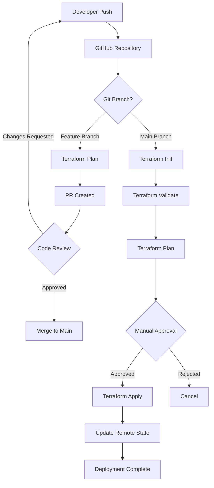

# Terraform CI/CD Pipeline Integration

## Overview
Automating Terraform infrastructure deployments using GitHub Actions CI/CD pipeline.

---

## Pipeline Architecture



---

## GitHub Actions Workflow

### File: `.github/workflows/terraform.yml`

```yaml
name: Terraform CI/CD

on:
  push:
    branches: [ main ]
  pull_request:
    branches: [ main ]

env:
  TF_VERSION: '1.5.0'
  AWS_REGION: 'us-east-1'

jobs:
  terraform:
    name: Terraform
    runs-on: ubuntu-latest
    
    defaults:
      run:
        working-directory: ./terraform

    steps:
    - name: Checkout
      uses: actions/checkout@v3

    - name: Configure AWS Credentials
      uses: aws-actions/configure-aws-credentials@v2
      with:
        aws-access-key-id: ${{ secrets.AWS_ACCESS_KEY_ID }}
        aws-secret-access-key: ${{ secrets.AWS_SECRET_ACCESS_KEY }}
        aws-region: ${{ env.AWS_REGION }}

    - name: Setup Terraform
      uses: hashicorp/setup-terraform@v2
      with:
        terraform_version: ${{ env.TF_VERSION }}

    - name: Terraform Format
      id: fmt
      run: terraform fmt -check -recursive
      continue-on-error: true

    - name: Terraform Init
      id: init
      run: terraform init

    - name: Terraform Validate
      id: validate
      run: terraform validate -no-color

    - name: Terraform Plan
      id: plan
      run: terraform plan -no-color -input=false
      continue-on-error: true

    # Only apply on push to main
    - name: Terraform Apply
      if: github.ref == 'refs/heads/main' && github.event_name == 'push'
      run: terraform apply -auto-approve -input=false
```

---

## Required GitHub Secrets

| Secret Name | Description | Source |
|-------------|-------------|--------|
| `AWS_ACCESS_KEY_ID` | AWS IAM user access key | IAM User Console |
| `AWS_SECRET_ACCESS_KEY` | AWS IAM user secret key | IAM User Console |
| `AWS_REGION` | AWS region (default: us-east-1) | Fixed value |

---

## Setup Steps

### 1. Create IAM User for CI/CD
```bash
aws iam create-user --user-name github-actions-terraform

# Attach minimal required policies
aws iam attach-user-policy \
  --user-name github-actions-terraform \
  --policy-arn arn:aws:iam::aws:policy/PowerUserAccess

# Create access keys
aws iam create-access-key --user-name github-actions-terraform
```

### 2. Configure Remote State Backend
```bash
# Create S3 bucket for state
aws s3api create-bucket \
  --bucket internship-terraform-state \
  --region us-east-1

# Enable versioning
aws s3api put-bucket-versioning \
  --bucket internship-terraform-state \
  --versioning-configuration Status=Enabled

# Create DynamoDB table for state locking
aws dynamodb create-table \
  --table-name internship-terraform-locks \
  --attribute-definitions AttributeName=LockID,AttributeType=S \
  --key-schema AttributeName=LockID,KeyType=HASH \
  --billing-mode PAY_PER_REQUEST
```

### 3. Add Secrets to GitHub
1. Go to GitHub repository → Settings → Secrets and variables → Actions
2. Add `AWS_ACCESS_KEY_ID` and `AWS_SECRET_ACCESS_KEY`

---

## Pipeline Security Best Practices

| Practice | Implementation |
|----------|---------------|
| **Least Privilege** | IAM user with only required permissions |
| **Secret Management** | GitHub Actions secrets for credentials |
| **Plan Before Apply** | PR workflow runs plan only |
| **Manual Approval** | Apply requires PR merge to main |
| **State Encryption** | S3 default encryption for state file |
| **Audit Trail** | Git history tracks all configuration changes |

---

## Cost Optimization in CI/CD

| Area | Optimization |
|------|-------------|
| **Plan Only** | PRs only run plan (no cost) |
| **Auto-Approval** | Main branch apply with auto-approve for speed |
| **State Storage** | S3 Standard-IA for state file |
| **Execution Time** | ~2-3 minutes per workflow run |

---

## References
- [GitHub Actions for Terraform](https://developer.hashicorp.com/terraform/tutorials/automation/github-actions)
- [AWS IAM Best Practices for CI/CD](https://docs.aws.amazon.com/IAM/latest/UserGuide/best-practices.html)
- [Terraform Backend Configuration](https://developer.hashicorp.com/terraform/language/settings/backends/s3)

