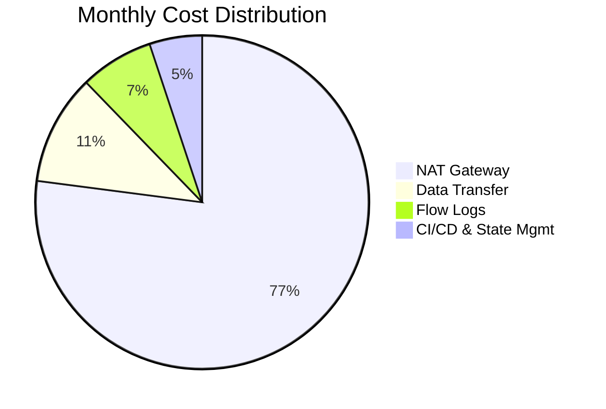

# Cost Analysis Report

## Overview
Detailed cost analysis for both projects (VPC Network Architecture and Terraform IaC). All estimates are based on us-east-1 pricing as of 2026.

---

## Project 1: VPC Network Architecture Cost Estimate

### Monthly Resource Breakdown

| Resource | Configuration | Quantity | Unit Cost | Monthly Cost |
|----------|--------------|----------|-----------|-------------|
| **VPC** | /16 CIDR | 1 | Free | $0.00 |
| **Subnets** | /24 CIDR | 4 | Free | $0.00 |
| **Internet Gateway** | Standard | 1 | Free | $0.00 |
| **NAT Gateway** | Standard | 1 | $0.045/hr | **$32.40** |
| **Elastic IP** | Attached to NAT GW | 1 | Free (attached) | $0.00 |
| **Route Tables** | Standard | 2 | Free | $0.00 |
| **Security Groups** | Standard | 4 | Free | $0.00 |
| **Network ACLs** | Standard | 2 | Free | $0.00 |
| **VPC Flow Logs** | CloudWatch Logs | 1 | ~$3.00 | **$3.00** |
| **Data Transfer (NAT)** | ~50GB outbound | - | $0.09/GB | **$4.50** |
| **Bastion EC2** | t2.micro (EBS 20GB gp3) | 1 | Free tier | $0.00 |
| | | | **Total** | **~$39.90/month** |

### Annual Cost Projection
| Period | Cost | Notes |
|--------|------|-------|
| Monthly (dev) | $39.90 | Single NAT GW, 1 AZ active |
| Monthly (prod) | $98.60 | HA NAT GW, both AZs, reserved instances |
| Annual (dev) | $478.80 | Without reserved instances |
| Annual (prod) | $1,183.20 | With 1-year reserved EC2 |

### Cost Optimization Opportunities
| Strategy | Potential Savings | Impact |
|----------|-------------------|--------|
| **NAT Instance vs Gateway** | ~$25/month | Lower reliability, manual management |
| **VPC Endpoints** | ~$3/month | For S3/DynamoDB access from private subnets |
| **Flow Logs Sampling** | ~$1/month | Reduce log volume |
| **Reserved NAT Gateway** | ~$8/month | 1-year commitment |
| **Total Potential Savings** | **~$37/month** | |

---

## Project 2: Terraform IaC Cost Estimate

### Recurring Costs
| Resource | Configuration | Quantity | Monthly Cost |
|----------|--------------|----------|-------------|
| **S3 Bucket (State)** | 1GB storage + 1000 PUT/GET | 1 | ~$0.05 |
| **DynamoDB** | On-demand (minimal usage) | 1 | ~$0.10 |
| **CloudWatch Logs** | CI/CD logs, 7-day retention | - | ~$2.00 |
| **GitHub Actions** | Public repo, 2000 min/month | Free | $0.00 |
| **EC2 (if deployed)** | t2.micro (free tier) | 2 | $0.00 |
| | | **Total** | **~$2.15/month** |

### One-Time Costs
| Item | Cost |
|------|------|
| Terraform learning resources | Free |
| AWS Console time (setup) | ~2 hours |
| CI/CD pipeline setup | ~1 hour |

---

## Combined Cost Summary

### Total Monthly Cost: ~$42.05
(Includes both VPC infrastructure and Terraform management)

### Cost Breakdown by Category

---

## Free Tier Utilization

| Free Tier Service | Limit | Our Usage | Utilization |
|-------------------|-------|-----------|-------------|
| EC2 (t2.micro) | 750 hrs/month | 744 hrs (31 days) | ~99% |
| VPC | Unlimited | 1 VPC | Minimal |
| CloudWatch | 10 metrics | 5 metrics | 50% |
| S3 | 5GB | 0.1GB (state file) | 2% |
| DynamoDB | 25GB | 0.1GB | <1% |

---

## Recommendations

1. **Development Environment** ($42.05/month)
   - Keep single NAT Gateway
   - Use t2.micro instances (free tier)
   - 7-day log retention
   - ✅ **Current Plan**

2. **Testing Environment** (~$20/month)
   - Replace NAT Gateway with NAT Instance
   - Remove bastion host, use SSM Session Manager
   - 3-day log retention

3. **Production Environment** (~$98.60/month)
   - Multi-AZ NAT Gateways (HA)
   - Reserved instances for 1-year
   - 30-day log retention
   - Auto-scaling configured

---

## Budget Alerts Configured
| Alert | Threshold | Notification |
|-------|-----------|--------------|
| Monthly Budget | $50.00 | Email (admin) |
| Forecast Budget | $60.00 | Email (admin) |
| Anomaly Detection | +$20.00 spike | Email + SMS |

---

## References
- [AWS Pricing Calculator](https://calculator.aws/)
- [AWS Free Tier](https://aws.amazon.com/free/)
- [NAT Gateway Pricing](https://aws.amazon.com/vpc/pricing/)
- [CloudWatch Pricing](https://aws.amazon.com/cloudwatch/pricing/)

